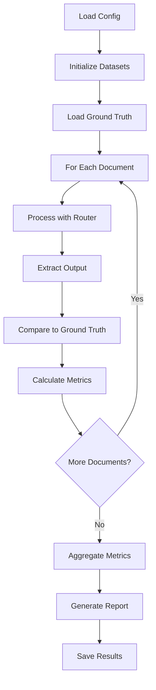

# Performance Benchmarking Guide

**Version**: 1.0
**Created**: 2025-11-03
**Owner**: Byron Williams
**Status**: Active

---

## Table of Contents

1. [Overview](#overview)
2. [Benchmarking Objectives](#benchmarking-objectives)
3. [Dataset Setup](#dataset-setup)
4. [Evaluation Framework](#evaluation-framework)
5. [Implementation Architecture](#implementation-architecture)
6. [Execution Workflow](#execution-workflow)
7. [Metrics & Reporting](#metrics--reporting)
8. [Success Criteria](#success-criteria)
9. [Integration with CI/CD](#integration-with-cicd)
10. [Troubleshooting](#troubleshooting)

---

## Overview

This guide provides a comprehensive framework for evaluating and benchmarking the Data Ingestor pipeline
using three industry-standard datasets. The benchmarking system validates core extraction capabilities,
establishes performance baselines, and enables continuous quality monitoring.

### Target Datasets

| Dataset | Sample Size | Purpose | Priority |
|---------|-------------|---------|----------|
| **ReadOC** | 500 | End-to-end PDF→Markdown validation | Critical |
| **DocLayNet** | 1,000 | Layout and reading order baseline | High |
| **PubTables-1M** | 500 | Table extraction validation | Critical |

**Total Evaluation Set**: 2,000 documents

### Expected Timeline

- **Dataset Download & Setup**: 1-2 days
- **Evaluation Framework Implementation**: 3-5 days
- **Initial Benchmark Run**: 1 day
- **Analysis & Reporting**: 1-2 days
- **Total**: ~1.5 weeks (Phase 1b)

---

## Benchmarking Objectives

### Primary Goals

1. **Validate Core Capabilities**
   - Text extraction accuracy >90%
   - Table structure preservation >95% (target: 97.9% with Docling)
   - Layout understanding and reading order preservation
   - Section/heading hierarchy accuracy

2. **Establish Performance Baselines**
   - Processing throughput (docs/hour)
   - Average processing time per document
   - Memory usage per document type
   - Error rates by document complexity

3. **Enable Comparative Analysis**
   - Parser performance comparison (PyMuPDF vs PyMuPDF4LLM vs Marker vs Docling)
   - Quality vs. speed trade-offs
   - Intelligent OCR routing efficiency
   - Regression detection across updates

4. **Support Intelligent Routing Validation**
   - Verify ~5x speedup from intelligent OCR
   - Validate routing accuracy (>90% correct path selection)
   - Confirm only 8-10% documents require slow OCR path

### Success Metrics

| Metric | Target | Measurement |
|--------|--------|-------------|
| Text Extraction Accuracy | >90% | CER, BLEU, chrF scores |
| Table Structure Accuracy | >95% | TEDS, Cell exact match |
| Reading Order Accuracy | >90% | Sequence F1, Kendall tau |
| Layout Classification mAP | >80% | Mean average precision |
| Processing Throughput | >1000 docs/hr | Parallel processing benchmark |
| OCR Speedup | >4x average | Intelligent routing vs. blanket OCR |
| Routing Accuracy | >90% | Correct path selection rate |

---

## Dataset Setup

### Directory Structure

```
data/
├── benchmarks/
│   ├── readoc/
│   │   ├── pdfs/              # 500 PDF files
│   │   ├── ground_truth/      # Corresponding markdown files
│   │   └── metadata.json
│   ├── doclaynet/
│   │   ├── pdfs/              # 1,000 PDF files
│   │   ├── annotations/       # COCO/JSON annotations
│   │   └── metadata.json
│   ├── pubtables-1m/
│   │   ├── pdfs/              # 500 PDF files with tables
│   │   ├── annotations/       # Table structure annotations
│   │   └── metadata.json
│   └── config.yaml            # Benchmark configuration
├── results/
│   ├── runs/                  # Individual benchmark run results
│   │   └── run_YYYYMMDD_HHMMSS/
│   │       ├── outputs/       # Generated outputs
│   │       ├── metrics.json   # Computed metrics
│   │       └── report.html    # HTML report
│   └── baselines/             # Baseline metrics for comparison
└── cache/                      # Downloaded datasets cache
```

### 1. ReadOC Dataset Setup

**Purpose**: End-to-end PDF→Markdown structure fidelity validation

**Download Instructions**:
```bash
# Clone the ReadOC repository
git clone https://github.com/readoc-benchmark/readoc.git data/cache/readoc

# Extract sample subset (500 documents)
python scripts/prepare_readoc.py \
    --source data/cache/readoc \
    --output data/benchmarks/readoc \
    --sample-size 500 \
    --stratified  # Ensure diverse document types
```

**Ground Truth Format**:
- Paired PDF and Markdown files
- 1:1 correspondence via filename
- Markdown includes structure annotations

**Key Metrics**:
- Section F1 (heading hierarchy preservation)
- List F1 (list structure accuracy)
- Code Block F1 (code extraction)
- Table F1 (table-to-markdown conversion)
- Text CER (character error rate)
- BLEU/chrF scores (text fidelity)

**Acceptance Criteria**:
- Section F1 > 0.85
- Table F1 > 0.75
- Text CER < 0.10

---

### 2. DocLayNet Dataset Setup

**Purpose**: Layout detection and reading order baseline

**Download Instructions**:
```bash
# Download from Hugging Face
python scripts/download_doclaynet.py \
    --output data/benchmarks/doclaynet \
    --split test \
    --sample-size 1000 \
    --include-annotations

# Alternative: Direct download
wget https://huggingface.co/datasets/ds4sd/DocLayNet/resolve/main/DocLayNet_core.zip
unzip DocLayNet_core.zip -d data/cache/doclaynet
```

**Ground Truth Format**:
- COCO/JSON format annotations
- 11 layout classes: text, title, list, table, figure, caption, footnote, formula, section-header, page-header, page-footer
- Bounding boxes with class labels
- Reading order sequences

**Key Metrics**:
- mAP (mean average precision) for layout classes
- Reading-order sequence F1
- Kendall tau (reading order correlation)
- Per-class precision/recall

**Acceptance Criteria**:
- mAP > 0.80
- Reading order accuracy > 0.90
- Per-class precision > 0.75

---

### 3. PubTables-1M Dataset Setup

**Purpose**: Table structure extraction and cell accuracy validation

**Download Instructions**:
```bash
# Download from Microsoft repository
python scripts/download_pubtables.py \
    --output data/benchmarks/pubtables-1m \
    --split test \
    --sample-size 500 \
    --complexity diverse  # Mix of simple and complex tables

# Download annotations
wget https://github.com/microsoft/table-transformer/releases/download/v1.0/PubTables-1M-Structure_Annotations.zip
```

**Ground Truth Format**:
- XML/JSON table structure annotations
- Row/column grid information
- Cell spans and merged cells
- Header vs. data cell classification

**Key Metrics**:
- TEDS (Tree Edit Distance Similarity)
- Cell exact match accuracy
- Row/column detection precision
- Header role F1

**Acceptance Criteria**:
- TEDS > 0.85 (target: 0.95+ with Docling TableFormer)
- Cell exact match > 0.90
- Header F1 > 0.85

---

### Dataset Configuration File

Create `data/benchmarks/config.yaml`:

```yaml
version: "1.0"
datasets:
  readoc:
    enabled: true
    sample_size: 500
    path: "data/benchmarks/readoc"
    metrics:
      - section_f1
      - list_f1
      - table_f1
      - text_cer
      - bleu
      - chrf
    weight: 0.4  # 40% of overall score

  doclaynet:
    enabled: true
    sample_size: 1000
    path: "data/benchmarks/doclaynet"
    metrics:
      - map_layout
      - reading_order_f1
      - kendall_tau
    weight: 0.3  # 30% of overall score

  pubtables:
    enabled: true
    sample_size: 500
    path: "data/benchmarks/pubtables-1m"
    metrics:
      - teds
      - cell_exact_match
      - header_f1
    weight: 0.3  # 30% of overall score

parsers:
  baseline:
    - pymupdf
    - pymupdf4llm
  phase2:
    - marker  # With intelligent OCR
    - docling  # For complex tables
    - pymupdf4llm
    - pymupdf

execution:
  parallel_workers: 4
  timeout_per_doc: 120  # seconds
  retry_on_failure: true
  max_retries: 2
  save_outputs: true

reporting:
  format: [html, json, csv]
  include_visualizations: true
  compare_to_baseline: true
  generate_diff_report: true
```

---

## Evaluation Framework

### Architecture

```
┌─────────────────────────────────────────────────────────────────┐
│                    Benchmark Orchestrator                        │
└────────────────────────┬────────────────────────────────────────┘
                         │
         ┌───────────────┼───────────────┐
         ▼               ▼               ▼
    ┌─────────┐    ┌─────────┐    ┌─────────┐
    │ ReadOC  │    │DocLayNet│    │PubTables│
    │Evaluator│    │Evaluator│    │Evaluator│
    └────┬────┘    └────┬────┘    └────┬────┘
         │              │              │
         └──────────────┼──────────────┘
                        ▼
            ┌───────────────────────┐
            │   Document Router     │
            │   (with parsers)      │
            └───────────┬───────────┘
                        ▼
            ┌───────────────────────┐
            │   Metric Calculator   │
            └───────────┬───────────┘
                        ▼
            ┌───────────────────────┐
            │   Report Generator    │
            └───────────────────────┘
```

### Core Components

#### 1. Benchmark Orchestrator

**Responsibility**: Coordinate benchmark execution across all datasets

**Location**: `src/data_ingestor/benchmarks/orchestrator.py`

```python
class BenchmarkOrchestrator:
    """Orchestrate benchmark execution across multiple datasets."""

    def __init__(self, config_path: Path):
        self.config = load_config(config_path)
        self.datasets = self._initialize_datasets()
        self.router = DocumentRouter()  # Use production router

    def run_benchmark(
        self,
        parsers: list[str] | None = None,
        save_outputs: bool = True
    ) -> BenchmarkReport:
        """
        Execute benchmark across all configured datasets.

        Args:
            parsers: List of parser IDs to test (None = all)
            save_outputs: Save generated outputs for inspection

        Returns:
            BenchmarkReport with aggregated metrics
        """
        # CRITICAL: Must handle parser failures gracefully
        # ASSUME: Datasets already downloaded and validated
```

#### 2. Dataset Evaluators

**Base Class**: `src/data_ingestor/benchmarks/base_evaluator.py`

```python
class BaseEvaluator(ABC):
    """Base class for dataset-specific evaluators."""

    @abstractmethod
    def load_ground_truth(self) -> list[GroundTruth]:
        """Load ground truth annotations."""

    @abstractmethod
    def compute_metrics(
        self,
        predictions: list[Document],
        ground_truth: list[GroundTruth]
    ) -> dict[str, float]:
        """Compute dataset-specific metrics."""

    @abstractmethod
    def generate_report(
        self,
        metrics: dict[str, float]
    ) -> str:
        """Generate human-readable report."""
```

**Implementations**:
- `ReadOCEvaluator`: PDF→Markdown structure fidelity
- `DocLayNetEvaluator`: Layout and reading order
- `PubTablesEvaluator`: Table structure extraction

#### 3. Metric Calculators

**Location**: `src/data_ingestor/benchmarks/metrics/`

```python
# Text fidelity metrics
def calculate_cer(prediction: str, reference: str) -> float:
    """Character Error Rate using edit distance."""

def calculate_bleu(prediction: str, reference: str) -> float:
    """BLEU score for text similarity."""

def calculate_chrf(prediction: str, reference: str) -> float:
    """Character-level F-score."""

# Structure metrics
def calculate_section_f1(
    pred_sections: list[Section],
    true_sections: list[Section]
) -> float:
    """Section hierarchy F1 score."""

def calculate_reading_order_f1(
    pred_order: list[int],
    true_order: list[int]
) -> float:
    """Reading order sequence F1."""

# Table metrics
def calculate_teds(
    pred_table: Table,
    true_table: Table
) -> float:
    """Tree Edit Distance Similarity for tables."""

def calculate_cell_exact_match(
    pred_table: Table,
    true_table: Table
) -> float:
    """Cell-level exact match accuracy."""

# Layout metrics
def calculate_map(
    predictions: list[BBox],
    ground_truth: list[BBox],
    iou_threshold: float = 0.5
) -> float:
    """Mean average precision for layout detection."""
```

---

## Implementation Architecture

### Module Structure

```
src/data_ingestor/
├── benchmarks/
│   ├── __init__.py
│   ├── orchestrator.py          # Main benchmark coordinator
│   ├── base_evaluator.py        # Abstract evaluator base class
│   ├── config.py                # Configuration management
│   ├── evaluators/
│   │   ├── __init__.py
│   │   ├── readoc_evaluator.py
│   │   ├── doclaynet_evaluator.py
│   │   └── pubtables_evaluator.py
│   ├── metrics/
│   │   ├── __init__.py
│   │   ├── text_metrics.py      # CER, BLEU, chrF
│   │   ├── structure_metrics.py # Section F1, Reading order
│   │   ├── table_metrics.py     # TEDS, Cell match
│   │   └── layout_metrics.py    # mAP, Detection metrics
│   ├── reporting/
│   │   ├── __init__.py
│   │   ├── report_generator.py
│   │   ├── visualizations.py
│   │   └── templates/
│   │       ├── html_report.jinja2
│   │       └── summary.jinja2
│   └── utils/
│       ├── __init__.py
│       ├── ground_truth_loader.py
│       └── output_comparator.py
```

### CLI Integration

Add benchmark commands to `src/data_ingestor/cli/main.py`:

```python
@app.command()
def benchmark(
    dataset: str = typer.Option("all", help="Dataset: readoc, doclaynet, pubtables, or all"),
    parsers: str = typer.Option(None, help="Comma-separated parser IDs"),
    output_dir: Path = typer.Option("data/results", help="Output directory"),
    compare_baseline: bool = typer.Option(True, help="Compare to baseline"),
):
    """Run benchmark evaluation on specified dataset(s)."""

@app.command()
def benchmark_report(
    run_id: str = typer.Argument(..., help="Benchmark run ID"),
    format: str = typer.Option("html", help="Report format: html, json, csv"),
):
    """Generate report for completed benchmark run."""
```

**Usage Examples**:

```bash
# Run full benchmark suite
uv run data-ingestor benchmark --dataset all

# Benchmark specific dataset with specific parsers
uv run data-ingestor benchmark \
    --dataset readoc \
    --parsers "marker,docling,pymupdf4llm" \
    --output-dir data/results/marker_evaluation

# Generate comparison report
uv run data-ingestor benchmark-report run_20251103_143022 --format html

# Quick validation run (subset)
uv run data-ingestor benchmark \
    --dataset readoc \
    --sample-size 50 \
    --quick-mode
```

---

## Execution Workflow

### Phase 1b Implementation Steps

#### Week 1: Dataset Setup & Infrastructure

**Day 1-2: Dataset Download & Preparation**
```bash
# Download all three datasets
python scripts/benchmarks/download_datasets.py --all

# Validate dataset integrity
python scripts/benchmarks/validate_datasets.py

# Generate dataset statistics
python scripts/benchmarks/analyze_datasets.py
```

**Day 3-4: Evaluation Framework Implementation**
- Implement `BaseEvaluator` abstract class
- Implement `ReadOCEvaluator`
- Implement `DocLayNetEvaluator`
- Implement `PubTablesEvaluator`
- Add unit tests for each evaluator

**Day 5: Metric Calculators**
- Implement text fidelity metrics (CER, BLEU, chrF)
- Implement structure metrics (Section F1, Reading order)
- Implement table metrics (TEDS, Cell exact match)
- Implement layout metrics (mAP)
- Add metric validation tests

#### Week 2: Execution & Reporting

**Day 6-7: Orchestrator & Integration**
- Implement `BenchmarkOrchestrator`
- Integrate with existing `DocumentRouter`
- Add CLI commands
- Integration testing

**Day 8: Initial Benchmark Run**
```bash
# Run baseline with current Phase 1 parsers
uv run data-ingestor benchmark \
    --dataset all \
    --parsers "pymupdf,pymupdf4llm" \
    --output-dir data/results/baseline_phase1 \
    --save-outputs
```

**Day 9: Report Generation**
- Implement HTML report generator
- Create visualizations (charts, tables)
- Generate baseline report
- Document findings

**Day 10: Documentation & Validation**
- Complete this benchmarking guide
- Add troubleshooting section
- Review and validate all metrics
- CI/CD integration setup

### Benchmark Execution Process



### Parallel Processing Strategy

```python
# CRITICAL: Parallel processing must handle failures gracefully
# ASSUME: Workers share DocumentRouter instance (thread-safe)

from concurrent.futures import ProcessPoolExecutor, as_completed

def process_document_batch(
    documents: list[Path],
    router: DocumentRouter,
    evaluator: BaseEvaluator
) -> list[tuple[Document, dict[str, float]]]:
    """Process batch of documents in parallel."""

    results = []
    with ProcessPoolExecutor(max_workers=4) as executor:
        futures = {
            executor.submit(process_single_doc, doc, router): doc
            for doc in documents
        }

        for future in as_completed(futures):
            doc_path = futures[future]
            try:
                result = future.result(timeout=120)
                metrics = evaluator.compute_metrics(result)
                results.append((result, metrics))
            except Exception as e:
                logger.error(f"Failed to process {doc_path}: {e}")
                # Continue with other documents

    return results
```

---

## Metrics & Reporting

### Metric Definitions

#### 1. Text Fidelity Metrics

**Character Error Rate (CER)**:
```
CER = (Insertions + Deletions + Substitutions) / Total Characters in Reference
```
- Lower is better (0.0 = perfect)
- Target: <0.10 (90% accuracy)

**BLEU Score**:
- N-gram overlap between prediction and reference
- Range: 0.0-1.0 (higher is better)
- Target: >0.70

**chrF Score**:
- Character-level F-score
- Better for morphologically rich languages
- Target: >0.75

#### 2. Structure Metrics

**Section F1**:
```
Precision = Correctly Identified Sections / Total Predicted Sections
Recall = Correctly Identified Sections / Total True Sections
F1 = 2 * (Precision * Recall) / (Precision + Recall)
```
- Considers hierarchy depth and nesting
- Target: >0.85

**Reading Order F1**:
- Sequence alignment F1 score
- Penalizes order inversions
- Target: >0.90

**Kendall Tau**:
- Rank correlation coefficient
- Measures reading order similarity
- Range: -1.0 to 1.0
- Target: >0.85

#### 3. Table Metrics

**TEDS (Tree Edit Distance Similarity)**:
```
TEDS = 1 - (Tree Edit Distance / Max(|Tree1|, |Tree2|))
```
- Measures structural similarity
- Accounts for cell merging, spanning
- Range: 0.0-1.0
- Target: >0.85 (>0.95 with Docling TableFormer)

**Cell Exact Match**:
```
Accuracy = Correctly Extracted Cells / Total Cells
```
- Requires exact text and position match
- Target: >0.90

#### 4. Layout Metrics

**mAP (Mean Average Precision)**:
```
AP_class = Area under Precision-Recall curve for class
mAP = Mean of AP across all classes
```
- IoU threshold: 0.5
- 11 layout classes
- Target: >0.80

### Report Structure

#### HTML Report Template

```html
<!DOCTYPE html>
<html>
<head>
    <title>Benchmark Report - {{ run_id }}</title>
</head>
<body>
    <h1>Data Ingestor Benchmark Report</h1>

    <section id="executive-summary">
        <h2>Executive Summary</h2>
        <table>
            <tr>
                <th>Metric</th>
                <th>Score</th>
                <th>Target</th>
                <th>Status</th>
            </tr>
            <!-- Aggregate metrics -->
        </table>
    </section>

    <section id="dataset-results">
        <h2>Dataset-Specific Results</h2>

        <h3>ReadOC (500 samples)</h3>
        <!-- ReadOC metrics, charts -->

        <h3>DocLayNet (1,000 samples)</h3>
        <!-- DocLayNet metrics, charts -->

        <h3>PubTables-1M (500 samples)</h3>
        <!-- PubTables metrics, charts -->
    </section>

    <section id="parser-comparison">
        <h2>Parser Comparison</h2>
        <!-- Comparative charts -->
    </section>

    <section id="performance">
        <h2>Performance Metrics</h2>
        <!-- Throughput, timing, resource usage -->
    </section>

    <section id="failure-analysis">
        <h2>Failure Analysis</h2>
        <!-- Error breakdown, examples -->
    </section>
</body>
</html>
```

#### JSON Report Schema

```json
{
  "run_id": "run_20251103_143022",
  "timestamp": "2025-11-03T14:30:22Z",
  "config": {
    "datasets": ["readoc", "doclaynet", "pubtables"],
    "parsers": ["pymupdf", "pymupdf4llm", "marker", "docling"],
    "sample_sizes": {
      "readoc": 500,
      "doclaynet": 1000,
      "pubtables": 500
    }
  },
  "aggregate_metrics": {
    "overall_score": 0.87,
    "text_accuracy": 0.92,
    "table_accuracy": 0.89,
    "layout_accuracy": 0.84
  },
  "dataset_results": {
    "readoc": {
      "metrics": {
        "section_f1": 0.88,
        "list_f1": 0.85,
        "table_f1": 0.79,
        "text_cer": 0.08,
        "bleu": 0.76,
        "chrf": 0.81
      },
      "samples_processed": 500,
      "failures": 3,
      "processing_time_avg": 2.4
    },
    "doclaynet": {
      "metrics": {
        "map_layout": 0.83,
        "reading_order_f1": 0.91,
        "kendall_tau": 0.88
      },
      "samples_processed": 1000,
      "failures": 8,
      "processing_time_avg": 1.8
    },
    "pubtables": {
      "metrics": {
        "teds": 0.87,
        "cell_exact_match": 0.91,
        "header_f1": 0.86
      },
      "samples_processed": 500,
      "failures": 2,
      "processing_time_avg": 3.1
    }
  },
  "parser_comparison": {
    "pymupdf": {
      "avg_score": 0.78,
      "speed_docs_per_hour": 1200,
      "memory_mb_avg": 450
    },
    "marker": {
      "avg_score": 0.89,
      "speed_docs_per_hour": 800,
      "memory_mb_avg": 1200
    }
  },
  "performance": {
    "total_documents": 2000,
    "total_time_seconds": 4320,
    "throughput_docs_per_hour": 1666,
    "avg_processing_time": 2.16,
    "memory_peak_mb": 3200
  },
  "failures": {
    "total": 13,
    "by_reason": {
      "timeout": 5,
      "parsing_error": 4,
      "out_of_memory": 2,
      "corrupted_file": 2
    }
  }
}
```

---

## Success Criteria

### Phase 1b Exit Criteria

✅ **Dataset Preparation**:
- [ ] All three datasets downloaded and validated
- [ ] Ground truth annotations loaded and verified
- [ ] Sample stratification ensures diversity

✅ **Framework Implementation**:
- [ ] `BenchmarkOrchestrator` functional
- [ ] All three evaluators implemented and tested
- [ ] Metric calculators validated against reference implementations
- [ ] CLI commands working

✅ **Baseline Execution**:
- [ ] Successful processing of 2,000 documents (500 + 1,000 + 500)
- [ ] <1% catastrophic failures
- [ ] All metrics computed correctly
- [ ] Reports generated (HTML + JSON)

✅ **Quality Validation**:
- [ ] ReadOC: Section F1 > 0.80 (baseline), target > 0.85
- [ ] DocLayNet: mAP > 0.75 (baseline), target > 0.80
- [ ] PubTables: TEDS > 0.80 (baseline), target > 0.85
- [ ] Overall text accuracy > 85% (baseline), target > 90%

✅ **Documentation**:
- [ ] This benchmarking guide complete
- [ ] Dataset setup scripts documented
- [ ] Metric calculation formulas verified
- [ ] Troubleshooting guide complete

### Phase 2 Validation Criteria (Post-Intelligent OCR)

After implementing Intelligent OCR and Docling integration (Phase 2), re-run benchmarks to validate:

✅ **Performance Improvements**:
- [ ] Average speedup > 4x vs. blanket OCR
- [ ] Only 8-10% documents use slow OCR path
- [ ] Throughput > 1,000 docs/hour

✅ **Quality Maintenance/Improvement**:
- [ ] ReadOC Section F1 > 0.85 (no regression)
- [ ] DocLayNet mAP > 0.80 (no regression)
- [ ] PubTables TEDS > 0.95 (improved with Docling TableFormer)
- [ ] Table accuracy > 95% (target: 97.9%)

✅ **Routing Accuracy**:
- [ ] Correct path selection > 90%
- [ ] Quality validation catches > 90% of failures
- [ ] Fallback rate < 5%

---

## Integration with CI/CD

### Automated Benchmark Runs

**Trigger Conditions**:
- On merge to `main` branch
- Weekly scheduled runs
- Manual trigger via GitHub Actions

**GitHub Actions Workflow** (`.github/workflows/benchmark.yml`):

```yaml
name: Benchmark Evaluation

on:
  push:
    branches: [main]
  schedule:
    - cron: '0 2 * * 0'  # Weekly on Sunday 2 AM
  workflow_dispatch:

jobs:
  benchmark:
    runs-on: ubuntu-latest
    timeout-minutes: 120

    steps:
      - uses: actions/checkout@v3

      - name: Set up Python
        uses: actions/setup-python@v4
        with:
          python-version: '3.11'

      - name: Install dependencies
        run: |
          pip install uv
          uv sync

      - name: Download datasets (cached)
        uses: actions/cache@v3
        with:
          path: data/benchmarks
          key: benchmarks-v1-${{ hashFiles('scripts/benchmarks/download_datasets.py') }}

      - name: Run benchmark
        run: |
          uv run data-ingestor benchmark \
            --dataset all \
            --output-dir data/results/ci_run_${{ github.sha }}

      - name: Compare to baseline
        run: |
          uv run python scripts/benchmarks/compare_to_baseline.py \
            --current data/results/ci_run_${{ github.sha }} \
            --baseline data/results/baselines/phase1_baseline.json

      - name: Upload results
        uses: actions/upload-artifact@v3
        with:
          name: benchmark-results
          path: data/results/ci_run_${{ github.sha }}/

      - name: Comment PR with results
        if: github.event_name == 'pull_request'
        uses: actions/github-script@v6
        with:
          script: |
            const fs = require('fs');
            const summary = JSON.parse(
              fs.readFileSync('data/results/ci_run_${{ github.sha }}/summary.json')
            );
            github.rest.issues.createComment({
              issue_number: context.issue.number,
              owner: context.repo.owner,
              repo: context.repo.repo,
              body: `## Benchmark Results\n\n${summary.markdown}`
            });
```

### Regression Detection

**Automated Checks**:
```python
def detect_regression(
    current_metrics: dict[str, float],
    baseline_metrics: dict[str, float],
    threshold: float = 0.05  # 5% regression tolerance
) -> list[str]:
    """
    Detect metric regressions compared to baseline.

    Returns:
        List of regressed metrics with details
    """
    regressions = []

    for metric, current_value in current_metrics.items():
        baseline_value = baseline_metrics.get(metric)
        if baseline_value is None:
            continue

        # CRITICAL: Lower is better for CER, higher for others
        if metric == "text_cer":
            regression = current_value > baseline_value * (1 + threshold)
        else:
            regression = current_value < baseline_value * (1 - threshold)

        if regression:
            regressions.append(
                f"{metric}: {current_value:.3f} vs baseline {baseline_value:.3f}"
            )

    return regressions
```

---

## Troubleshooting

### Common Issues

#### 1. Dataset Download Failures

**Symptom**: `ConnectionError` or incomplete downloads

**Solutions**:
```bash
# Retry with increased timeout
python scripts/download_datasets.py --timeout 3600 --retry 5

# Use alternative download method
python scripts/download_datasets.py --method direct

# Manual download
# Visit dataset URLs and download manually to data/cache/
```

#### 2. Ground Truth Loading Errors

**Symptom**: `JSONDecodeError`, `KeyError` in annotations

**Solutions**:
```python
# Validate ground truth format
python scripts/benchmarks/validate_ground_truth.py --dataset readoc

# Re-download corrupted files
python scripts/benchmarks/download_datasets.py --dataset readoc --force
```

#### 3. Memory Exhaustion

**Symptom**: `MemoryError`, OOM kills during benchmark

**Solutions**:
```bash
# Reduce batch size
uv run data-ingestor benchmark --batch-size 10

# Process sequentially (no parallelism)
uv run data-ingestor benchmark --workers 1

# Process subset
uv run data-ingestor benchmark --sample-size 100
```

#### 4. Metric Calculation Failures

**Symptom**: `ValueError`, `TypeError` in metric computation

**Debugging**:
```python
# Enable debug logging
uv run data-ingestor benchmark --log-level DEBUG

# Save intermediate outputs
uv run data-ingestor benchmark --save-outputs --debug-mode

# Validate specific document
python scripts/benchmarks/debug_single_doc.py \
    --document data/benchmarks/readoc/pdfs/sample_001.pdf \
    --ground-truth data/benchmarks/readoc/ground_truth/sample_001.md
```

#### 5. Slow Benchmark Execution

**Symptom**: Benchmark takes >6 hours for 2,000 documents

**Optimizations**:
```bash
# Increase parallelism
uv run data-ingestor benchmark --workers 8

# Skip output saving
uv run data-ingestor benchmark --no-save-outputs

# Profile execution
uv run python -m cProfile -o benchmark.prof \
    -m data_ingestor.cli.main benchmark --dataset readoc

# Analyze profiling results
uv run python scripts/analyze_profile.py benchmark.prof
```

---

## Next Steps

After completing Phase 1b benchmarking:

1. **Establish Baselines**
   - Document Phase 1 baseline metrics
   - Create baseline artifacts for comparison
   - Set up automated regression detection

2. **Implement Phase 2 Enhancements**
   - Intelligent OCR routing
   - Docling integration
   - HTR pipeline

3. **Re-run Benchmarks**
   - Validate improvements
   - Measure speedup (target: >4x)
   - Confirm quality maintenance

4. **Continuous Monitoring**
   - Weekly automated runs
   - Regression alerts
   - Performance tracking

---

## References

- [datasets.md](datasets.md) - Complete dataset catalog
- [PROJECT_PLAN.md](PROJECT_PLAN.md) - Overall project roadmap
- [INTELLIGENT_OCR_SYSTEM.md](INTELLIGENT_OCR_SYSTEM.md) - OCR routing design
- [DOCLING_INTEGRATION.md](DOCLING_INTEGRATION.md) - Docling integration details

---

**Document Control**:
- **Version**: 1.0
- **Last Updated**: 2025-11-03
- **Next Review**: After Phase 1b completion
- **Owner**: Byron Williams
