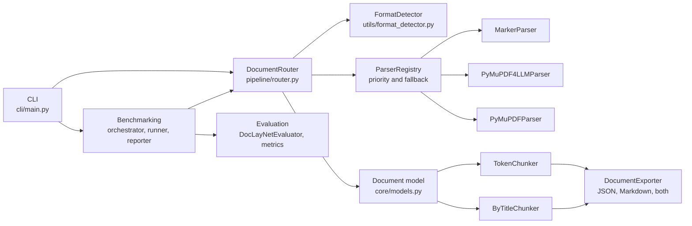

# Level 1: Chunk Stage Architecture

Last verified against the code on 2026-10-02 (branch `docs/pipeline-level-0`). Context:
[Level 0](../level-0/index.md) and [pipeline-level-0.md](../../pipeline-level-0.md).

## Role

`data_ingestor` is the **Chunk** stage. The pipeline contract expects it to read `DoclingDOM.json` from Unify and
write `RAGChunkSet.json` for downstream applications. Today the repository is a standalone PDF ingestion toolkit that
parses a PDF itself and chunks the result. It does not yet read `DoclingDOM.json` or write `RAGChunkSet.json`.

## Components (as built on this branch)

| Component | Location | Notes |
| --- | --- | --- |
| Router and registry | `pipeline/router.py` | Parsers ordered by `get_priority()` (lower runs first), with fallback on failure |
| Format detection | `utils/format_detector.py` | libmagic, then mimetypes, then extension |
| PDF parsers | `parsers/pdf_parser.py` | `MarkerParser` (priority 10), `PyMuPDF4LLMParser` and `PyMuPDFParser` (base default 100) |
| PDF pre-flight | `pipeline/pdf_analyzer.py`, `utils/pdf_resolution.py`, `utils/pdf_upscaler.py` | DPI analysis and upscaling |
| Chunkers | `chunking/` | `TokenChunker` (token window with overlap), `ByTitleChunker` (section-aware) |
| Exporter | `export/exporter.py` | JSON, Markdown with YAML front matter, or both |
| CLI | `cli/main.py` | `process`, `health`, `benchmark`, `benchmark-report`, `benchmark-configs` |
| Evaluation | `evaluation/` | `DocLayNetEvaluator`, text, structure, layout, and table metrics |
| Benchmarking | `benchmarking/` | orchestrator, runner, reporter, baseline, fingerprint, config tester |

## Inputs and outputs

| Direction | Pipeline contract expects | Status |
| --- | --- | --- |
| In | `DoclingDOM.json` from Unify (`03-docling-dom/`) | Not built on this branch |
| In (today) | A PDF file, parsed in-process by PyMuPDF, PyMuPDF4LLM, or Marker | Built |
| Out | `RAGChunkSet.json` (`04-chunks/`) with `chunk_id`, `document_id`, `trace_id`, `trust_score`, `page_range`, `section_hierarchy` | Not built; a different chunk JSON is exported today |
| Out (today) | Document JSON or Markdown with chunks, via `DocumentExporter` | Built |
| Trust scoring, hallucination risk | Required by the chunk contract | Not built (`quality/` is an empty stub) |

Contract authority: `chunk-embed-contract.md` in
[image-preprocessing-detector](https://github.com/williaby/image-preprocessing-detector) under
`docs/development/RAG Pipeline/`. An open pull request (#67) proposes a docling-serve client, a Docling reader, and a
`HybridChunker`; none of that is on this branch.

## Status

| Capability | Status |
| --- | --- |
| PDF parsing (three parsers, fallback chain) | Built |
| Token and by-title chunking | Built |
| JSON and Markdown export | Built |
| CLI | Built |
| DocLayNet evaluation and benchmarking framework | Built; baseline run not yet recorded (see [PHASE1_COMPLETION_STATUS.md](../../../PHASE1_COMPLETION_STATUS.md)) |
| DOCX, HTML, video, audio parsing | Not built (no parser classes exist) |
| Docling parser | Not built (referenced only in benchmark config tooling) |
| PubTables evaluator | Not built (`evaluation/metrics/table_metrics.py` exists; no evaluator file) |
| `DoclingDOM.json` reader | Planned (Chunk stage requirement) |
| `RAGChunkSet.json` writer and trust scoring | Planned (Chunk stage requirement) |
| `api/`, `storage/`, `quality/` packages | Empty stubs |

## Out of scope for this repository

Per the Level 0 page, these belong to downstream applications:

- Embedding models and endpoints
- Vector stores
- Search APIs and ranking
- Chat or question answering
- A REST API for retrieval (the empty `api/` package is not a pipeline requirement)

Older planning documents (`docs/PROJECT_PLAN.md`, `docs/MULTIMODAL_RAG_*.md`) describe embedding and search work;
they carry status banners marking those parts as out of scope.
